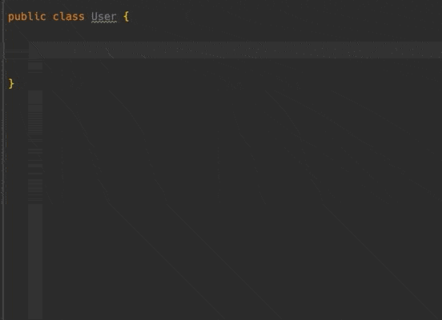

##  TypingCat 
> TypingCat 是一个英语单词拼写提示与补全插件

[Plugin Homepage](https://plugins.jetbrains.com/plugin/17950-typingcat)

### Support

### Feature

- 包含1万个常用单词
- 支持应用于代码命名：局部变量、常量、方法名、方法参数、类名
- 支持模糊搜索
- 基于代码补全，使用快捷键 "Ctrl + space"
- 离线模式，响应更快

### Preview

### Trending

